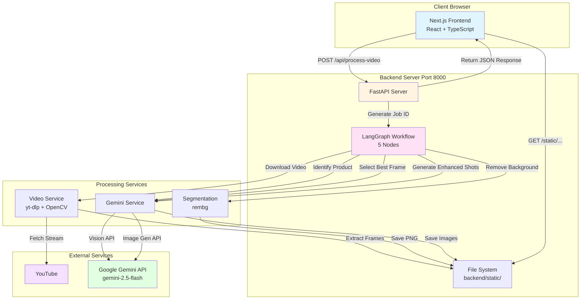
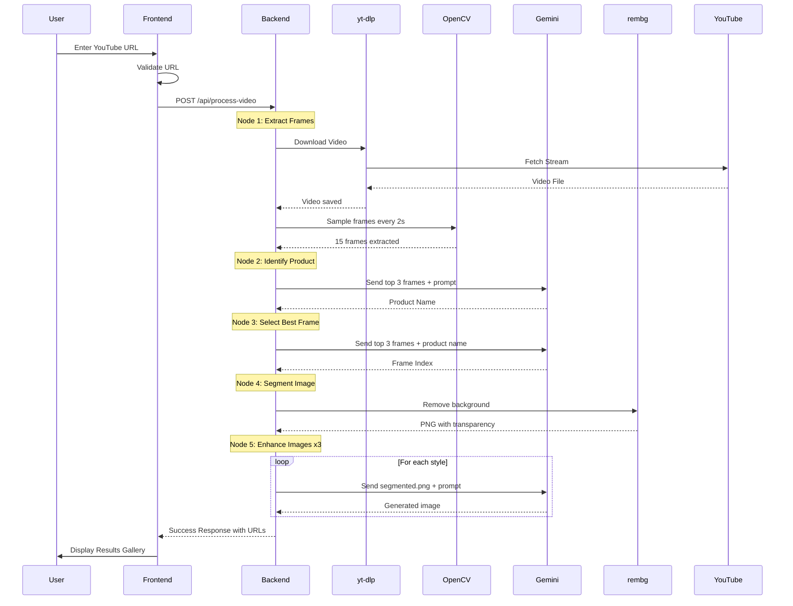
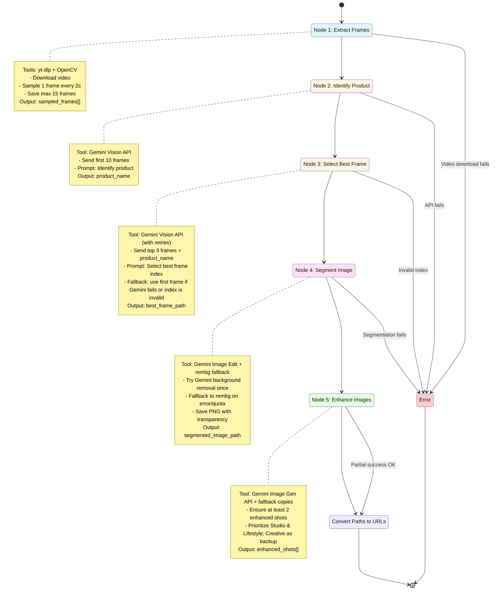
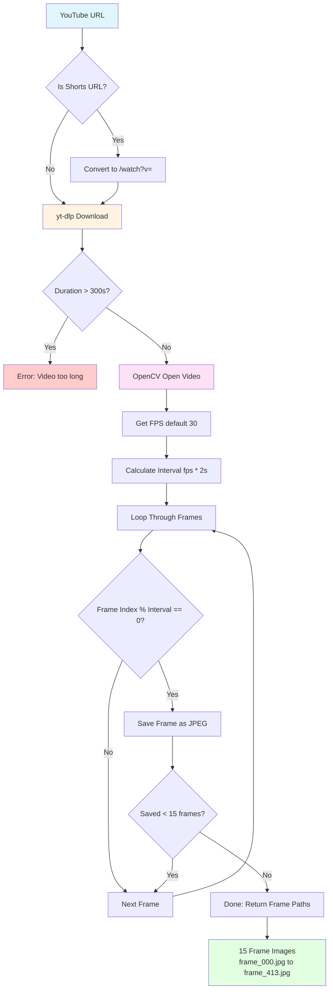

# AI Product Extractor - Architecture & Flow Diagrams

This document contains comprehensive Mermaid diagrams illustrating how the AI Product Extractor application works.

---

## Technologies Used

### Backend Technologies

1. **yt-dlp** (`yt-dlp>=2023.12.30`)
   - Downloads YouTube videos for processing
   - Supports both `/watch?v=` and `/shorts/` formats
   - Downloads in lowest quality for faster processing
   - Used in `backend/app/services/video.py`

2. **OpenCV** (`opencv-python>=4.8.1.78`)
   - Extracts frames from downloaded video
   - Samples 1 frame every 2 seconds (configurable)
   - Extracts maximum 15 frames per video
   - Saves frames as JPEG images
   - Used in `backend/app/services/video.py`

3. **Google Gemini API** (`google-genai>=0.2.0`)
   - Model: `gemini-2.5-flash`
   - **Vision API**: Product identification and best frame selection
   - **Image Generation API**: Creates two enhanced shots (studio, lifestyle) with creative as backup
   - Used in `backend/app/services/gemini.py`

4. **rembg** (`rembg>=2.0.55`)
   - Removes background from product images using AI
   - Creates transparent PNG files
   - Used in `backend/app/services/segmentation.py`

5. **LangGraph** (`langgraph>=0.2.0`)
   - Orchestrates workflow as a state machine with 5 nodes
   - Manages state transitions and error handling
   - Used in `backend/app/workflow.py`

6. **FastAPI** (`fastapi==0.104.1`)
   - REST API server on port 8000
   - Endpoints: `POST /api/process-video`, `GET /static/{job_id}/{filename}`
   - Used in `backend/app/main.py`

### Frontend Technologies

- **Next.js 16** with App Router
- **React 19** for UI components
- **TypeScript** for type safety
- **Tailwind CSS 4** for styling

---

## 1. System Architecture



---

## 2. Complete User Flow



---

## 3. Backend Workflow - LangGraph State Machine (5 Nodes)



**What are "Nodes"?**

In LangGraph, a **node** is a processing step in the workflow. Each node:
- Takes the current workflow state as input
- Performs a specific task (download video, call API, process image, etc.)
- Updates the state with new data
- Passes control to the next node

Our workflow has **5 nodes**:
1. **extract_frames** - Downloads video and extracts frames
2. **identify_product** - Identifies the product from the top 3 frames
3. **select_best_frame** - Uses Gemini with retries; falls back to the first frame on failure
4. **segment_image** - Tries Gemini once; falls back to rembg to ensure a transparent PNG
5. **enhance_images** - Produces at least 2 enhanced shots (Studio, Lifestyle; Creative as backup/fallback copies)

---

## 4. Video Processing Flow - yt-dlp + OpenCV



---

## 5. Data Flow Through System

```mermaid
graph TD
    URL[YouTube URL String]
    
    URL --> JOBID[Job ID UUID]
    
    JOBID --> VIDEO[Video File temp/video.mp4]
    VIDEO --> FRAMES[Frame Images<br/>frame_000.jpg<br/>frame_059.jpg<br/>...<br/>frame_413.jpg]
    
    FRAMES --> PRODUCT[Product Name<br/>iPhone 15 Pro]
    FRAMES --> BEST[Best Frame<br/>frame_118.jpg]
    
    BEST --> SEGMENTED[Segmented Image<br/>segmented.png<br/>Transparent Background]
    
    SEGMENTED --> ENH1[Enhanced Studio<br/>enhanced_studio.png]
    SEGMENTED --> ENH2[Enhanced Lifestyle<br/>enhanced_lifestyle.png]
    SEGMENTED --> ENH3[Enhanced Creative<br/>enhanced_creative.png]
    
    BEST --> URL1[/static/job_id/frames/frame_118.jpg]
    SEGMENTED --> URL2[/static/job_id/segmented.png]
    ENH1 --> URL3[/static/job_id/enhanced/enhanced_studio.png]
    ENH2 --> URL4[/static/job_id/enhanced/enhanced_lifestyle.png]
    ENH3 --> URL5[/static/job_id/enhanced/enhanced_creative.png]
    
    URL1 --> RESPONSE[ProcessVideoResponse<br/>JSON with all URLs]
    URL2 --> RESPONSE
    URL3 --> RESPONSE
    URL4 --> RESPONSE
    URL5 --> RESPONSE
    
    RESPONSE --> FRONTEND[Frontend Receives JSON]
    FRONTEND --> DISPLAY[Display Images in Gallery]
    
    style URL fill:#e1f5ff
    style PRODUCT fill:#fff4e1
    style SEGMENTED fill:#ffe1f5
    style RESPONSE fill:#e1ffe1
```

---

## Summary: How It Works

### Step-by-Step Process

1. **User Input** → Frontend validates YouTube URL and sends to backend

2. **Node 1: Extract Frames**
   - **yt-dlp** downloads video (lowest quality for speed)
   - **OpenCV** samples 1 frame every 2 seconds
   - Saves max 15 frames as JPEG: `frame_000.jpg`, `frame_059.jpg`, etc.

3. **Node 2: Identify Product**
   - First 10 frames sent to **Gemini Vision API**
   - Returns product name (e.g., "iPhone 15 Pro")

4. **Node 3: Select Best Frame**
   - All frames + product name sent to **Gemini Vision API**
   - Returns frame index number
   - Selects best frame file

5. **Node 4: Segment Image**
   - **rembg** removes background from best frame
   - Saves as PNG with transparency: `segmented.png`

6. **Node 5: Enhance Images**
   - **Gemini Image Generation API** called 3 times
   - Each sends `segmented.png` + style prompt:
     - **Studio**: White background, professional
     - **Lifestyle**: Desk scene, natural lighting
     - **Creative**: Gradient background, dramatic
   - Saves: `enhanced_studio.png`, `enhanced_lifestyle.png`, `enhanced_creative.png`

7. **Response** → File paths converted to URLs, JSON response sent to frontend

8. **Display** → Frontend shows images in ResultsGallery component

### Processing Time

- **Typical**: 30-60 seconds per video
- Video download: 5-10s
- Frame extraction: 2-5s
- Product identification: 3-5s
- Best frame selection: 3-5s
- Background removal: 2-3s
- Image enhancement (x3): 15-30s

### LangGraph Nodes Explained

The workflow uses **5 nodes** (processing steps) in LangGraph:

1. **extract_frames** - Downloads video and extracts frames using yt-dlp + OpenCV
2. **identify_product** - Uses Gemini Vision API to identify the product
3. **select_best_frame** - Uses Gemini Vision API to select the best frame
4. **segment_image** - Uses rembg to remove background
5. **enhance_images** - Uses Gemini Image Generation API to create 3 enhanced shots

Each node takes the workflow state, processes it, and updates the state for the next node.
