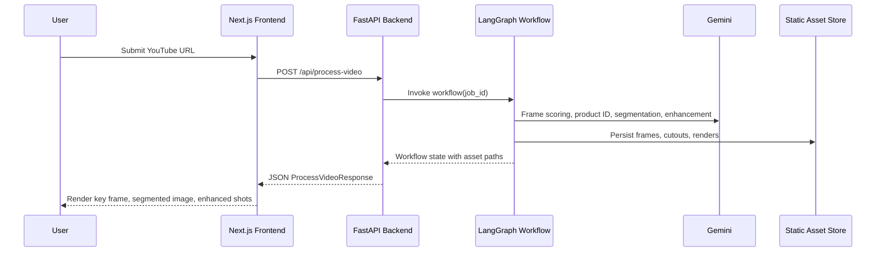
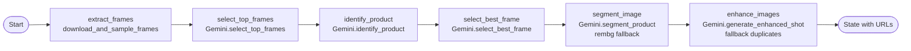

# AI Product Imagery – Implementation Summary

## 1. End-to-End Flow

- The Next.js frontend collects a YouTube URL and POSTs it to the FastAPI endpoint at `/api/process-video`.
- FastAPI launches a LangGraph `StateGraph` workflow, tracking intermediate assets in a per-request job folder (`static/{job_id}`) so the frontend can read results from `/static/...` URLs.
- The workflow downloads the video, samples frames, lets Gemini pick the best product shot, segments the product, then generates enhanced marketing renders.
- A structured JSON payload (`ProcessVideoResponse`) returns product metadata together with static URLs for the selected key frame, segmented mask, and enhanced shots.

### Sequence Overview

## 2. LangGraph Workflow (Backend)

- **Graph Orchestration**: `app/workflow.py` wires six LangGraph nodes that mirror the assignment steps. Each node reads/writes fields on a shared `WorkflowState` dictionary.
- **Frame Extraction (`extract_frames`)**: `services/video.py` uses `yt-dlp` to download the clip (with retries, Shorts normalization, and duration guard), then OpenCV samples up to 15 frames at the configured interval.
- **Top Frame Selection (`select_top_frames`)**: Gemini `gemini-2.5-flash` evaluates every sampled frame and returns indices for the three most promising product views.
- **Product Identification (`identify_product`)**: Gemini analyzes the three candidate frames and outputs a canonical product name.
- **Best Frame Pick (`select_best_frame`)**: Gemini scores the short list to find the hero frame; if the API misbehaves or returns an out-of-range index, we fall back deterministically to the first frame.
- **Segmentation (`segment_image`)**: Gemini image editing tries to remove the background; on any failure we drop down to `rembg` to guarantee a clean cutout.
- **Enhancement (`enhance_images`)**: Gemini image editing consumes the segmented PNG plus hand-crafted prompts (`services/enhancement_prompts.py`) to synthesize up to two marketing-ready renders (studio + lifestyle). Fallback logic duplicates earlier outputs if quotas prevent new generations.

### LangGraph Node Flow

## 3. Gemini Utilization

- **Models**: `gemini-2.5-flash` drives multimodal reasoning (frame scoring + product naming). `gemini-2.5-flash-image-preview` powers segmentation and image-to-image enhancement.
- **Robustness**: Centralized in `services/gemini.py` with retry helpers that detect quota/rate limit phrases, apply exponential backoff, and surface structured errors (`GeminiServiceError`).
- **Prompting**: Descriptive prompts keep Gemini focused on visual clarity, brand-safe lighting, and realistic context.

## 4. Frontend (React/Next.js)

- **UX Flow**: `app/page.tsx` holds the single-page experience: URL input (`VideoInput`), visual loader (`ProcessingStatus`), and results grid (`ResultsGallery`).
- **API Client**: `lib/api.ts` bridges to the backend, validating response shapes and surfacing human-readable errors.
- **Static Asset Resolution**: `lib/url.ts` stitches relative `/static/...` paths to the configured API origin (`NEXT_PUBLIC_API_BASE_URL`).
- **Rendering**: Responsive Tailwind classes to present the key frame, cutout, and enhanced shots in a concise gallery.

## 5. Backend Services & Configuration

- **Frameworks**: FastAPI + Uvicorn serve the API; Pydantic validates inbound/outbound schemas.
- **Job Storage**: `utils/file_paths.py` provisions `static/{job_id}/frames|segmented|enhanced` folders per request to keep assets isolated.
- **Environment**: `.env` (`backend/app/config.py`) expects `GEMINI_API_KEY`, `BACKEND_PORT`, `STATIC_DIR`, `FRAME_SAMPLE_RATE`, `MAX_VIDEO_DURATION`.
- **Dependencies** (`backend/requirements.txt`): LangGraph, LangChain, Google GenAI SDK, yt-dlp, OpenCV, Pillow, rembg, FastAPI stack.

## 6. API Contract & Data Flow

- **Request**: `POST /api/process-video` with JSON `{ "video_url": "https://youtube.com/..." }`.
- **Response (success)**: `{ status: "success", job_id, product_name, key_frame_url, segmented_image_url, enhanced_shots[], processing_time_seconds }`.
- **Response (error)**: `{ status: "error", job_id, message }`, with HTTP `400` for predictable failures (invalid video, Gemini issues) or `500` for unexpected crashes.
- **Static Delivery**: FastAPI mounts `StaticFiles` at `/static`; the frontend simply drops the returned URLs into `` tags.

## 7. Running the Stack Locally

1. **Backend**
   - `cd backend`
   - `python -m venv .venv`
   - `.\.venv\Scripts\Activate`
   - `pip install -r requirements.txt`
   - Copy `.env.example` → `.env`, add a valid `GEMINI_API_KEY`
   - `uvicorn app.main:app --reload --port %BACKEND_PORT%`
2. **Frontend**
   - `cd frontend`
   - `npm install`
   - Create `.env.local` with `NEXT_PUBLIC_API_BASE_URL=http://localhost:8000`
   - `npm run dev`
   - Open `http://localhost:3000`

## 8. Challenges & Mitigations

- **Gemini Rate Limits**: Added retry/backoff helpers plus deterministic fallbacks (first frame, rembg segmentation, frame duplication) to keep the pipeline resilient.
- **YouTube Download Variability**: Normalized Shorts URLs, widened yt-dlp timeouts, and introduced multi-attempt downloads to handle flaky network paths.
- **Maintaining Asset Hygiene**: Per-job directories ensure concurrent requests never overwrite each other; assets stay accessible for the frontend without extra storage services.

## 9. Time Allocation (estimates)

- Frame download + sampling pipeline: ~3 h (yt-dlp integration, OpenCV tuning)
- LangGraph workflow design + state management: ~2 h
- Gemini client + prompting experiments: ~4 h (includes retries, fallbacks)
- Segmentation + enhancement fallbacks (rembg, duplication): ~1.5 h
- Next.js UI & API wiring: ~2 h
- Testing, logging, docs: ~1 h

## 10. Future Improvements

- Batch product detection for multi-product videos and separate enhancement per SKU.
- Persistent asset storage (S3/GCS) with signed URLs and scheduled cleanup.
- Asynchronous/background job queue so the API returns immediately with job status polling.
- Fine-tuned enhancement prompts per product category and user-selectable style presets.
- Add Cypress/Playwright smoke tests and LangGraph unit tests for individual nodes.
